<h1 align="center">Nodejs</h1>

## Tabla de contenidos

* [V8](#v8)
* [Expresiones](#expresiones)
    * [Tipos de datos](#tipos-de-datos)
    * [Varibles](#variables)
    * [Operadores lógicos](#operadores-lógicos)
    * [Condicionales](#condicionales)
    * [Objetos](#objetos)
    * [Colecciones](#colecciones)
    * [Bucles](#bucles)
    * [Funciones](#funciones)
    * [Callbacks](#callbacks)
        * [Callbacks](#callbacks)
        * [Callbacks hell](#callbacks-hell)
    * [Promesas](#promesas)
    * [Async/Await](#async/await)
* [Módulos](#módulos)
* [Sincronía vs Asincronía](#sincroníavs-asincronía)
    * [El versus](#el-versus)
    * [Eventos](#eventos)
    * [Event Emitter](#event-emitter)
* [Protocolo HTTP y servidores web](#protocolo-http-y-servidores-web)
    * [¿Que son?](#que-son)
    * [Creando un servidor web](#creando-un-servidor-web)
    * [Entendiendo el servidor web](#entendiendo-el-servidor-web)
    * [Rutas](#rutas)
    * [Express](#express)
    * [Rutas con express](#rutas-con-express)
* [Proyecto Quotes](#proyecto-quotes)
    * [Parte 1](#parte-1)
    * [MVC](#mvc)
    * [Parte 2](#parte-2)
    * [Parte 3](#parte-3)
* [Base de datos](#base-de-datos)
    * [Introducción](#introducción)
    * [Sequelize](#sequelize)
    * [Mongoose](#mongoose)
* [Frontend y Backend](#frontend-y-backend)
    * [Backend](#backend)
    * [Frontend](#frontend)
* [Notas](#notas)


# V8

V8 es el motor de código abierto de alto rendimiento de JavaScript y WebAssembly de Google, escrito en C ++. Se usa en Chrome y en Node.js, entre otros. Implementa [ECMAScript](https://tc39.es/ecma262/) y [WebAssembly](https://webassembly.github.io/spec/core/) , y se ejecuta en Windows 7 o posterior, macOS 10.12+ y sistemas Linux que usan procesadores x64, IA-32, ARM o MIPS. V8 puede ejecutarse de forma independiente o puede integrarse en cualquier aplicación C ++.

------
# Repaso JavaScript

## Expresiones

Es cualquier cosa que produzca un valor primitivo...

```javascript
'Hi' // Esto es una exprecsón
1 // Esto es una expresión
1.1 // Esto es una expresión
true // Esto es una expresión
function() {} // Esto es una expresión
```

## Tipos de datos

- Object: es el padre de los demas tipos, esto quiere decir que los tipos heredan de aquí.
- String: cadenas de texto representados por: "" '' ``.
- Number: familia de números enteros.
- Boolean: true o false.
- Array, Set, Map: colecciones que se almacenan de forma secuencial que se puede acceder a ellos por un índice.
- Function: tipo de función que realiza una acción.
- Symbol: es un tipo de datos cuyos valores son únicos e immutables.
- Undefined: valor no ha sido definido.
- Null: Ausencia de valor.

## Variables

Una variable está formada por un espacio en el sistema de almacenaje y nombre simbólico que esta asociado a dicho espacio.

Las variables persisten en la memoria RAM.

```javascript
var catName; // versiones anteriores
let myAge = 25;
const PI = 3.1416

const greet = () => {};
greet()
```

## Operadores lógicos

```javascript
// ==
// >
// <
// >=
// <=
// &&
// ||
let color = 'blue'
let isBlue = color === 'blue'
let edad = 18
let mayorEdad = edad >= 18
console.log(mayorEdad)
```

## Condicionales

```javascript
const age = 45
const calification = 80
const operation = 'add'
let n1 = 80
let n2 = 60

if (age >= 18 ) {
    console.log('es meyor de edad')
} else {
    console.log('es menor de edad')
}

if (calification >= 90) {
    console.log('A')
} else if (calification >= 80 && calification < 90) {
    console.log('B')
} else if (calification >= 70 && calification < 80) {
    console.log('C')
} else {
    console.log('Reprobado')
}

switch (operation) {
    case 'add':
        console.log(n1 + n2)
        break
    case 'subs':
        console.log(n1 - n2)
        break
	default: 'operación no valida'
}
```

## Objetos

Se conoce tambien como json, estan representados por un key y una value.

Podemos acceder al objeto de manera:

- Bracket notation. ejem object['key']
- Dot notation. ejem object.key

```javascript
const person = {
    name: 'Hugo',
    lastName: 'Roca',
    isStudent: true,
    getFullName () {
        return `${this.name} ${this.lastName}`
    }
}
console.log(person['name'])
console.log(person.name)
console.log(person.getFullName())
```

También podemos llevarlo a clase.

```javascript
class Person {
    constructor (name) {
        this.name = name
    }
    
    getName () {
        return this.name
    }
}

const person = new Person('Hugo')
console.log(person.getName())
```

## Colecciones

```javascript
// ARRAYS
const fruits = ["apple", "melon", "mango"]
console.log(fruits[1]) // melon
console.log(fruits[1]) // apple
// -
const fruits = ["apple", "melon", "mango", () => { console.log("Hola") }]
console.log(fruits[3]()) // Hola

// SETS
const numbers = new Set()
numbers.add(5) // no almacena valores repetidos
numbers.add(6)

// MAPS
const students = new Map()
students.set("one", "Hugo")
console.log(students.get("one"))
```

## Bucles

```javascript
const fruits = ["apple", "melon", "mango"]
console.log(fruits(0)) // bad
console.log(fruits(1)) // bad
console.log(fruits(2)) // bad

for (let i = 0; i <= fruits.length; i++) {
    console.log(fruits[i])
}

for (const fruit of fruits) {
    console.log(fruit)
}

const people = [{ name: "hugo1" }, { name: "hugo2" } ]
for (const person in people) {
    console.log(people[person].name)
}

let iterator = 0
while (iterator < people.length) {
    console.log(people[iterator])
    iterator++
}

do {
    console.log(people[iterator])
    iterator++
} while (iterator < people.length)
```

## Funciones

```javascript
function greet(name) {
    console.log("hi" + name)
}
greet("hugo") // hi hugo

function calc(n1, n2) {
    console.log(n1 + n2)
}
calc(1, 2) // 3

const greetMe = (name) => console.log(`Hola ${name}`)
greetMe("hugo") // Hola hugo
```

## Callbacks

### Callbacks

```javascript
setTimeout(function, time, arg?)
setTimeout(() => {
	console.log(`Hello word`)
}, 2000)

// Ejemplo
function calculate(n1, n2, operation) {
    return operation(n1, n2)
}
function add(n1, n2) {
    return n1 + n2
}
const result = calculate(1, 8, add)
console.log(result) // 9
```

- **Ventajas**
  - Simple: son conceptualmente simples. Pasas una función que quieres que se ejecute después.
  - Universal: corren donde se, no requiere de una transpilador.
- **Desventajas**
  - Composición tosca: las llamadas anidadas pueden llevar a realizar un código con aún mas anidaciones dentro (callback hell).
  - Flujo poco intuitivo: requieres que te muevas dentro del código para comprender el flujo del mismo.

Aquí veremos un ejemplo mas completo:

```javascript
const booksDb = [
    {
        id: 1,
        title: "web development with nodejs"
    },
    {
        id: 2,
        title: "the pragmatic programmer"
    }
]

function getBookById(id, callback) {
    const book = booksDb.find(book => book.id === id)
    if (!book) {
        // el primer parametro siempre es error
        const error = new Error()
        error.message = "book not found!"
		return callback(error)
    }
    
    callback(null, book)
}

getBookById(2, (error, book) => {
    if (error) return console.log(error.message)
    return console.log(book)
})
```

### Callbacks hell

Es una mala practica el cual se puede solucionar con funciones async/await. Aquí un ejemplo:

```javascript
const booksDb = [
    {
        id: 1,
        title: "web development with nodejs",
        authorId: 1
    },
    {
        id: 2,
        title: "the pragmatic programmer",
        authorId: 2
    }
]

const authorsDb = [
    {
        id: 1,
        name: "Robert C. Martin"
    },
    {
        id: 2,
        name: "Steve Forest"
    }
]

function getBookById(id, callback) {
    const book = booksDb.find(book => book.id === id)
    if (!book) {
        // el primer parametro siempre es error
        const error = new Error()
        error.message = "book not found!"
		return callback(error)
    }
    
    callback(null, book)
}

function getAuthorById(id, callback) {
    const author = authorsDb.find(author => author.id === id)
    if (!author) {
        // el primer parametro siempre es error
        const error = new Error()
        error.message = "author not found!"
		return callback(error)
    }
    
    callback(null, author)
}

getBookById(2, (err, book) => {
    if (err) return console.log(err.message)
    getAuthorById(book.authorId, (err, author) => {
        if (err) return console.log(err.message)
        console.log(`This book ${book.title} was written by ${author.name}`)
    })
    return console.log(book)
})
```

## Promesas

Es un objeto que representa la terminación o el fracaso eventual de una operación asíncrona. Esencialmente una promesa es un objeto devuelto al cual se adjuntan funciones callback, en lugar de pasar callbacks a una función.

```javascript
// tienen dos parametros resolver y reject
function executor(resolve, reject) {
    resolve() // si todo funciona bien
    reject() // si falla
}
const promise = new Promise(executor)
// tiene 3 métodos:
// .then() llega la data, siempore y cuando el metodo se haya invocado
// .catch() llega el error
// .finaly() siempre pasa por aqui
```

| Ventajas                                                     | Desventajas                                                  |
| :----------------------------------------------------------- | :----------------------------------------------------------- |
| - Fácilmente enlazable: se pueden enlazar fácilmente para manejar flujos asíncronos complejos sin tener que recurrir a mas anidaciones como se requieren en callbacks. | - Excepciones que desaparecen: Se debe declarar .catch() para manejar errores en lugar del tradicional try/catch. |
| - Poderoso: proporcionan una cantidad excepcional para componer operaciones asíncronas complejas. |                                                              |

Aquí un ejemplo de promesas usando el ejemplo de callbaks anterior:

```javascript
const booksDb = [] // datos en ejemplos anteriores
const authorsDb = [] // datos en ejemplos anteriores

function getBookById(id) {
    return new Promise((resolve, reject) => {
        const book = booksDb.find(book => book.id === id)
        if (!book) {
            const error = new Error()
            error.message = "book not found!"
            reject(error)
        }

        resolve(book)
    })
}

function getAuthorById(id) {
    return new Promise((resolve, reject) => {
        const author = authorsDb.find(author => author.id === id)
        if (!author) {
            const error = new Error()
            error.message = "author not found!"
            reject(error)
        }

        resolve(author)
    })
}

getBookById(1)
    .then(book => { 
        return getAuthorById(book.id) 
    })
    .then(author => {
        console.log(author)
    })
    .catch(err => {
        console.log(err.message)
    })
```


> **Usa promesas en vez de callbacks para mantener el standard. Ten cuidado en caer en el promise hell por la excesiva anidación.**


## Async/Await

| Async                                                        | Await                                                        |
| ------------------------------------------------------------ | ------------------------------------------------------------ |
| Cuando se llama a una función **async**, esta devuelve un elemento **Promise**. Cuando la función **async** devuelve un valor, **promise** se resolverá con el valor devuelto. Si la función **async** genera una excepción o algún valor, **promise** se rechazará con el valor generado. | La expresión **await** provoca que la ejecución de una función **async** sea pausada hasta que la **promise** sea terminada o rechazada, y regresa a la ejecución de la función **async** después del termino. Al regreso de la ejecución, el valor de la expresión **await** es la regresada por una promesa terminada |

Vamos a trabajar en el mismo ejemplo de callbacks:

```javascript
const booksDb = [] // datos en ejemplos anteriores
const authorsDb = [] // datos en ejemplos anteriores

async function getBookById(id) {
    const book = booksDb.find(book => book.id === id)
    if (!book) {
        const error = new Error()
        error.message = "book not found!"
        throw error
    }

    return book
}

async function getAuthorById(id) {
    const author = authorsDb.find(author => author.id === id)
    if (!author) {
        const error = new Error()
        error.message = "author not found!"
        throw error
    }
    return author
}

async function main() {
    try {
        const book = await getBookById(1)
        const author = await getAuthorById(book.authorId)
        console.log(`This book ${book.title} was written by ${author.name}`)
    } catch (error) {
        console.log(error.message)
    }
}

main()
```


> **Cuando utilizas async y await tienes un código muchas más limpio y sobre todo un mejor control de las excepciones. De ser posible, siempre utiliza async y await.**

-----
# Módulos

Bloque de código reutilizable cuya existencia no afecta accidentalmente a otro código. Javascript no tenia esto antes, de hecho esto se introdujo de la versión 6, sin embargo al momento de la creación de nodejs, javascript aun no tenia esta función, entonces que se hacia antes? Nodejs integro commonJS, y que es, esto es solo un conjunto de estándares para estructurar código.

Con **module.exports** creamos un módulo.

Con **require** obtendremos el modulo creado.

Para entenderlo mejor aquí veremos un ejemplo:

```
// tenemos la siguiente estrucutura
├── src
│   ├── logger.js
│   ├── main.js
```

Cada archivo obtendrá un modulo sin afectar al otro.

```javascript
// logger.js
function greet(name) {
    console.log('Hola ' + name)
}
module.exports = greet
```

```javascript
// main.js
const logger = require('./logger')
logger('Hugo')
```

También se puede realizar un objeto de funciones, variables, etc.

```javascript
// logger.js
function greet(name) {
    console.log('Hola ' + name)
}

function sayHello() {
    console.log()
}

module.exports = {
    greet,
    sayHello,
    number: 10
}
```

Al archivo anterior lo puedo referenciar de dos maneras, la primera es igualándolo a una sola variable y la otra es separarlas por variables.

Veamos la primera:

```javascript
// main.js
const logger = require('./logger')
logger.greet('Hugo')
logger.sayHello()
console.log(logger.number)
```

Ahora la segunda:

```javascript
// main.js
const { greet, sayHello, number } = require('./logger')
greet('Hugo')
sayHello()
console.log(number)
```

------
# Sincronía vs Asincronía

## El versus

Ahí que tener en cuenta que **javascript no es asincrono!**

Entonces que es asincronía? Pues es simple, es cuando uno o mas procesos se ejecutan simultáneamente.

Nodejs hace las cosas de manera asíncrona, sin embargo v8 se ejecuta sincrónicamente.

Que es sincronía? Pues si varios procesos a la ves es asincronía, pues entonces un solo proceso a la vez es síncrono.


> **Javascript fue diseñado para ser síncrono, sin embargo nodejs es asíncrono, v8 esta incrustado en el.**


## Eventos

Que son los eventos? Un evento es algo que ha sucedido en nuestra aplicación al que podemos responder.

En node.js existen dos tipos de eventos.

- Eventos de sistema: Esto proviene del lado del c++ que es el core de nodejs, gracias a un librería llamada **libuv**.
- Eventos personalizados: Es completamente diferente, está dentro del núcleo de JavaScript y básicamente es una librería javascript que trata de eventos en que podemos manipular nuestras donde básicamente ocurre algo y nosotros vamos a responder.

A menudo nos confundimos porque muchas veces cuando ocurre un evento de **libuv** genera un evento javascript personalizado para que sea más fácil administrar nuestro código y decidir que código debe ejecutar cuando ocurre este evento.

Vamos a crear nuestro emisor de eventos:

1. Tenemos la siguiente estructura

```
├── src
│   ├── emitter.js
│   ├── index.js
```

2. Nos situamos en el archivo emmiter.js

```javascript
function Emitter() {
    this.events = {}
}

// los eventos se invocan con la palabra "on"
// Recibirá dos parametros
Emitter.prototype.on = (type, listener) => {
    this.events[type] = this.events[type] || []
    this.events[type].push(listener)
}
/** 
TEST
Emitter.on('save', () => {})
Cuando se emita el evento 'save' lo que sea que este dentro de la función se va ejecutar,
pero debemos de tener una función que emita dicho evento. ↓↓
*/
Emitter.prototype.emit = (type) => {
    if (this.events[type]) {
        // si existe el type, entonces ejecutamos el array
        this.events[type].forEach(listener => listener())
    }
}

module.exports = Emitter
```

3. Nos situamos en el archivo index.js

```javascript
const Emitter = require(./emitter)
const emitter = new Emitter()
// agreamos 2 eventos
emitter.on('save', () => {
    console.log('On save activated 1')
})
emitter.on('save', () => {
    console.log('On save activated 2')
})
// ejecutamos los eventos
emitter.emit('save')
```

## Event emitter

Usaremos el paquete por defecto de nodejs "events", para este ejemplo usaremos el archivo indes.js del ejemplo anterior.

```javascript
const { EventEmitter } = require('events')
const emitter = new Emitter()
// agreamos 2 eventos
emitter.on('save', () => {
    console.log('On save activated 1')
})
emitter.on('save', () => {
    console.log('On save activated 2')
})
// ejecutamos los eventos
emitter.emit('save')
```

El resultado será el mismo, pero con la pequeña diferencia que usamos el paquete por defecto de nodejs.

------
# Protocolo HTTP y servidores web

## ¿Que son?

**HTTP** es el sistema mediante el cual se permite la transferencia de información entre diferentes servicios y una pagina web o cualquier aplicación que invoque el protocolo HTTP. 

Es muy común que escuchen hablar tambien de HTTPS que es exactamente lo mismo solo que la información viaja encriptada, la "S" es de security.

Un **servidor web** no es mas que un software que se encarga de despachar el contenido de un sitio web al usuario, un servidor web es lo que está detrás de esa vía. 

No se debe de confundir con el servidor como tal ya que el servidor es el lugar físico que podría contener un servidor web.

> **Nodejs es bastante bueno para crear servicios web**

## Creando un servidor web

```javascript
// hacemos referencía del paquete http que ya viene por defecto
const http = require('http')
// request => petición http
// response => respuesta
http.createServer((request, response) => {
    response.write("hello word")
    response.end()
})
// los servidores web deben de tener un puerto en especifico
http.listen(8080)
// ejecutamos y accedemos de un navegador http://localhost:8080
```

## Entendiendo el servidor web

Para entender todo lo que hemos hecho para crear nuestro servidor web primero veamos una pequeña analogía.

Tenemos un cliente que este caso es un simple navegador web que hace una petición HTTP, hace un request a un servidor, ese servidor recibe el request lo procesa y devuelve un mensaje a nuestro cliente y todo esto pasa mediante el protocolo HTTP que claro también podría ser HTTPS.

Creamos un archivo HTMLpara realizar este ejemplo, esto lo usaremos para presentar una pagina HTML en lugar de un write.

```javascript
// creamos un archivo js
const http = require('http')
const fs = require('fs')
const html = fs.readFileSync('./index.html')

http.createServer((request, response) => {
    response.writeHead(200, { "Content-Type": "text/html" })
    response.write(html)
    response.end()
}).listen(8080)
```

## Rutas

Las rutas son identificadores únicos que distingue cada recurso de nuestro servidor web. Por ejemplo si nosotros hacemos una petición HTTP GET a nuestro servidor web que tenemos actualmente para nuestro servidor esta es la ruta "/".

Creamos dos pagina HTML que la nombraremos **about.html** e **index.html**

```javascript
// creamos un archivo js
const http = require('http')
const fs = require('fs')
const home = fs.readFileSync('./index.html')
const about = fs.readFileSync('./about.html')

http.createServer((request, response) => {
    // rescatamos la url
    const { url } = request
    if (url === '/') {
        response.writeHead(200, { "Content-Type": "text/html" })
	    response.write(home)
    } else if (url === '/about') {
        response.writeHead(200, { "Content-Type": "text/html" })
	    response.write(about)        
    } else {
        response.writeHead(404, { "Content-Type": "text/html" })
	    response.write('Page not found!')           
    }
    response.end()
}).listen(8080)
```

## Express

Es hora de simplificar la vida de cientos de código utilizando librerías de terceros, así que vamos a conocer a **express** y cuales son las bondades y ventajas que nos provee.

Para instalar un paquete necesitamos inicializar el proyecto, ejecutamos el siguiente código:

Cabe recalcar que ya debemos de tener instalado **npm** en nuestro entorno.

```
npm init -y // -y para crearlo rapido
```

Esto nos creara un archivo llamado: **package.json**, en este archivo estará todas nuestras dependencias del proyecto.

Ahora instalamos **express** ejecutando lo siguiente: `npm install express -save`

Esto agregará una carpeta **node_module**, aquí se encontrará todo nuestro paquetes, cabe recalcar que esta carpeta debería de estar en el archivo **.gitignore** para que sea ignorado al momento de hacer un **push** de código.

Ahora veremos como simplificamos el código que creamos para levantar un servidor.

```javascript
const express = require('express')
const server = express()

server.listen(8080, () => {
    console.log('Server in running in port 8080')
})
```

Con esa porción de código ya tendremos nuestro servicio creado pero sin las rutas.

## Rutas con express

Realizar un una ruta con **express** es tan fácil como invocar el server.

Express tiene estos metodos HTTP:

- **GET**: lectura
- **POST**: crear un nuevo recurso
- **PUT**: reemplazar un recurso existente
- **PATCH**: actualizar una propiedad de un recurso
- **DELETE**: remover un recurso

```javascript
const express = require('express')
const server = express()
const fs = require('fs')
const home = fs.readFileSync('./index.html')
const about = fs.readFileSync('./about.html')

server.get('/', (req, res) => {
    res.write(home)
})

server.get('/about', (req, res) => {
    res.write(about)
})

server.listen(8080, () => {
    console.log('Server in running in port 8080')
})
```

------
# Proyecto Quotes

Llego el momento de poner en practica todo lo que hemos visto hasta ahora sobre protocolos HTTP y los servidores web, así que vamos hacer un proyecto pequeño de quotes.

Sera un simple portal web de tres paginas diferentes cada uno con sus rutas donde la pagina principal es el home que nos mostrará una bienvenida.

Case destacar que con esto pondremos en practica todo lo aprendido con **express**. También contaremos con **endpoints** que lo ejecutaremos desde [postman](https://www.postman.com/) que nos permitirá agregar contenido a la pagina.

## Parte 1

Para este pequeño proyecto vamos a inicializarlo con npm `npm init -y`

Dentro del archivo creado nos ubicamos dentro de **"scripts"** y agregar lo siguiente:

```json
{
    "scripts": {
        "start": "node index.js", // npm start
        "dev": "nodemon index.js" // npm run dev
    }
}
```

Estas líneas de código nos ayudará a ejecutar nuestro proyecto mas rápido y fácil. También instalaremos nuestras dependencias de proyecto:

```javascript
// en la console ejecutamos estos comandos por separado
npm i nodemon -D 
// nodemon nos servira para que nuestro servidor se reinicia cuando guardemos alguos cambios
npm i express
```

Ahora creamos una carpeta a la que llamaremos **config** y dentro un archivo **index.js**. Dentro de **index.js** hacemos lo siguiente:

```javascript
module.exports = {
    PORT: process.env.PORT || 4000
}
// si la variable de entorno no existe entonces que le ponga por defecto 4000
```

Ahora creamos una archivo **index.js** en la raíz del proyecto, este archivo será el que ejecute todo el proyecto.

```javascript
const express = require("express")
const server = express()
const { PORT } = require("./config")

server.listen(PORT, () => {
    console.log(`Application running in port ${PORT}`)
})
```

## MVC

Nuestro proyecto se desarrollará bajo el patrón **MVC**.

Este es una patrón de software para programación que propone separar el código de los programas por sus diferentes responsabilidades.

Entonces como funciona? Tenemos un modelos, un controlador y una vista, imaginemos que nuestro cliente hace un llamado HTTP a una web y recibe una vista pero esa vista es muy probable de que necesite información, por lo tanto le dice al controlador *"mira me llamaron esta vista, que hay que hacer?"* entonces solo le dice *renderizar algo solamente*.

Pero si hay que buscar alguna información o incluso contactarse con otra entidad pues se va llamar a un modelo que es una representación de la base de datos, o puede darse el caso de que hayan otras capas intermedias.

Cuando se busque la información necesaria desde la base de datos, en este caso por ejemplo, el modelo le contesta al controlador y el controlador le contesta a la vista que a su vez la vista que se muestra la ve el cliente y básicamente esto es lo que compone el modelo o el patrón de diseño MVC.

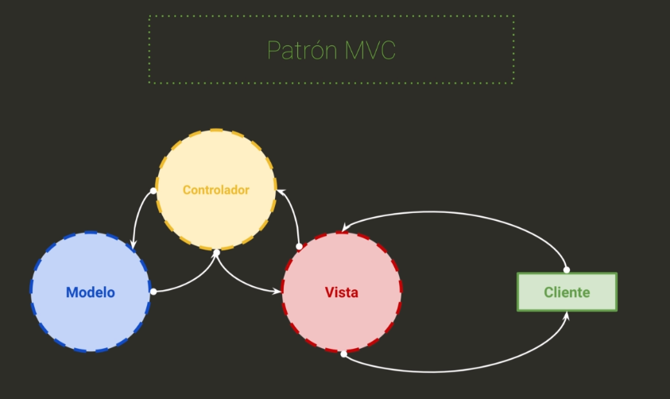

## Parte 2

En la misma ruta de este repositorio encontraran una carpeta llamada **recursos/quotes-parte-2**. Tanto la carpeta **public** como **views** la copiamos a nuestro proyecto.

La carpeta **views** tiene tres archivos **html**, la carpeta **public** tiene una carpeta **css** que tiene dos archivos, **bootstrap** y **styles**, mientras que la otra carpeta **js** tiene una librería **axios** que es muy buena para peticiones **HTTP** y un archivo **app.js**. 


> **Un middleware es un bloque de código que se ejecuta entre la petición que hace el usuario hasta que la petición llega al servidor**, es un intermediario. Como por ejemplo si queremos saber si un usuario está autenticado o no, podríamos crear un **midleware** que se encargue de comprobar dicha lógica o incluso transformar una información a otra.


Dentro del archivo **index.js** agregar esta línea de código justo antes de `server.listen`

```javascript
server.use(express.static("./public"))
server.use(express.json())
```

Ahora crearemos las siguientes carpetas:

- controller
- routes
- data

Dentro de **data** creamos un nuevo archivo **db.json**. Luego agregamos un archivo index.js en las carpetas de **controller** y **routes**.

Dentro de la carpeta **route** creamos nuestro primer controlador al que nombraremos **home.route.js**.

```javascript
const router = require("express").Router()
const { HomeController } = require("../controllers")

router.get("/", HomeController.index)

module.exports = router
```

Dentro de la carpeta **routes** en el archivo **index.js** hacemos lo siguiente:

```javascript
module.exports = {
    HomeRoutes: require("./home.routes")
}
```

En el archivo **index.js** de la raíz del proyecto vamos a agregar las rutas lo cual modificamos de tal manera que nos quede así:

```javascript
const express = require("express")
const server = express()
const { PORT } = require("./config")
const { HomeRoutes } = require("./routes")

server.use(express.static("./public"))
server.use(express.json())

server.use("/", HomeRoutes)

server.listen(PORT, () => {
    console.log(`Application running in port ${PORT}`)
})
```

## Parte 3

El siguiente paso será crear un middleware para que nos valide si la ruta existe. Creamos una carpeta nueva a la cual llamaremos **middlewares**, esto tendrá dos archivos **index.js** y **not-found.middleware.js**.

```javascript
// archivo not-found.middleware.js
module.exports = (req, res, next) => {
    return res.status(404).send({
        message: "Page not found!!"
    })
}
```

Ahora en el **index.js** que esta dentro de la carpeta **middleware** exportamos de la siguiente manera:

```javascript
module.exports = {
    NotFoundMiddleware: require("./not-found.middleware")
}
```

En el **index.js** de la raíz exportamos nuestro middleware:

```javascript
const { NotFoundMiddleware } = require("./middlewares")
...
server.use(NotFoundMiddleware)

// server.listen.......
```

Dentro de la carpeta **controllers** agregamos un nuevo archivo **home.controller.js**

```javascript
const path = require("path")

function render(file, res) {
    return res.sendFile(path.join(__dirname + `/../views/${file}.html`))
}

class HomeController {
    async index(req, res) {
        return render("home", res)
    }
    
    async about(req, res) {
        return render("about", res)
    }
}

module.exports = new HomeController()
```

Ahora para que esto funcione debemos de agregar en **home.routes.js** lo siguiente:

```javascript
// lo agregamos debajo de router.get....
router.get("/about", HomeController.about)
```

Creamos un nuevo controller **quotes.controller.js**

```javascript
const path = require("path")
const DB_PATH = path.join(__dirname + "/../data/db.json")
const fs = require("fs")
const db = require(DB_PATH)

function render(file, res) {
    return res.sendFile(path.join(__dirname + `/../views/${file}.html`))
}

class QuotesController {
    async index(req, res) {
        return render("quotes", res)
    }
}

module.exports = new QuotesController()
```

Luego en el archivo **index.js** de **controller** agregamos el controlador.

```javascript
module.exports = {
    HomeController: require("./home.controller"),
    QuotesControlle: require("./quotes.controller")
}
```

Agregamos un archivo mas dentro de **routes** al que llamaremos **quotes.route.js**

```javascript
const router = require("express").Router()
const { QuotesController } = require("../controllers")

router.get("/quotes", QuotesController.index)

module.exports = router
```

Dentro de **index.js** en la carpeta **routes** agregamos la ruta que hemos creado

```javascript
module.exports = {
    HomeRoutes: require("./home.routes"),
 	QuotesRoutes: require("./quotes.route")   
}
```

Y como paso final al archivo **index.js** de la raiz del proyecto queda asi:

```javascript
const express = require("express")
const server = express()
const { PORT } = require("./config")
const { HomeRoutes, QuotesRoutes } = require("./routes")
const { NotFoundMiddleware } = require("./middlewares")

server.use(express.static("./public"))
server.use(express.json())

server.use("/", HomeRoutes)
server.use("/", HomeRoutes)
server.use(NotFoundMiddleware)

server.listen(PORT, () => {
    console.log(`Application running in port ${PORT}`)
})
```

Agregamos los siguientes métodos dentro **quotes.controller.js**.

```javascript
async get(req, res) {
    return res.send(db)
}

async add(req, res) {
    const { body: quote } = req
    const lastQuote = db[db.length - 1]
    const { id } = lastQuote
    quote.id = id + 1
    db.push(quote)
    fs.writeFileSync(DB_PATH, JSON.stringify(db))
    return res.status(201).send()
}
```

Dentro de **quotes.route.js** agregamos las rutas

```javascript
router.get("/quote/all", QuotesController.get)
router.post("/quote/", QuotesController.add)
```

Ahora ejecutamos nuestro proyecto, si nos dimos cuenta nuestro archivo **db.json** esta vacío, por lo tanto nuestra vista **quotes** se vera vacío.

Podemos registrar datos mediante **postman** ejecutando de la siguiente manera.

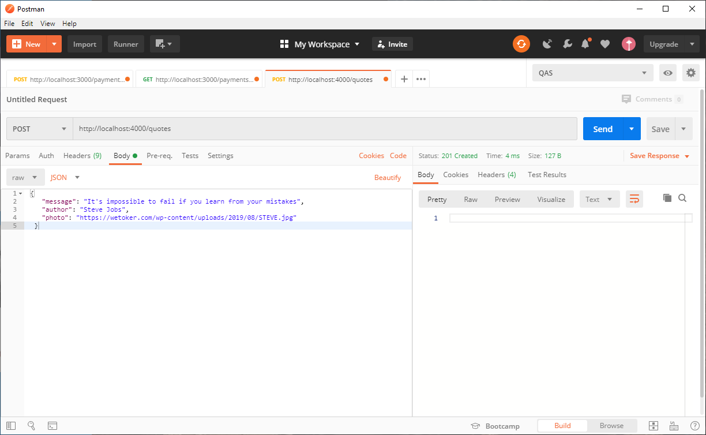

Y nuestra pantalla final se verá así:


Por si no te salió, te dejo el código aquí para que puedas ver en que fallaste, no te sientas mal, así se aprende. 

Clic [aquí](https://github.com/HugoRoca/Node.js/tree/master/recursos/proyecto%20quotes) para ver el código, recuerda que tiene que ejecutar el comando `npm install` para que las dependencias se instalen.

-----
# Base de datos

## Introducción

**¿Que es una base de datos relacional?** Básicamente el principio de la base de datos relacional se basa es una organización de la información en trozos pequeños, que se relacionan entre ellos mediante la relación de identificadores.

Algunos motores relacionales son:

- SQL server
- Oracle
- Postgress
- MySql
- SQLite

**¿Qué son las bases de datos no relacionales?** Como su propio nombre lo indica, las bases de datos no relacionales son las que, a diferencia de las relaciones, no tienen un identificador que sirva de relación entre un conjunto de datos y otros. Son muy útiles cuando no tenemos un esquema exacto de lo que se va a almacenar.

Algunos motores no relacionales:

- MongoDb
- Casandra
- RethinkDB
- Firebase Database
- Redis

<h3 align="center">
SQL
</h3>
Esta tabla de personas se pudiera relacionar con otra mas.


|  id  | name  | lastname | age  |
| :--: | :---: | :------: | :--: |
|  1   | Peter |  Smith   |  22  |
|  2   | Jhon  |   Doe    |  45  |

<h3 align="center">
NO SQL
</h3>

En cambio una tabla no relacional es una document object

```json
[
    {
        "id": 1,
        "name": "Peter",
        "lastname": "Smith",
        "age": 22
    },
    {
        "id": 2,
        "name": "Jhon",
        "lastname": "Doe",
        "age": 45
    }
]
```

Para este caso estaremos usando una ORM y ODM

- SQLite -> Sequelize
- MongoDb -> Mongoose


## Sequelize

Sequelize nos simplifica la vida con las bases de datos relacionales.

Creamos una nueva carpeta en donde pondremos todo nuestros archivos de ejemplo. Iniciamos el proyecto con `npm init -y` y procedemos a instalar las dependencias necesarias para nuestro proyecto, como consejo en este caso es mejor instalar sequelize-cli en modo global con `npm i sequelize-cli -g` y las demás dependencias las instalamos de la siguiente manera `npm i sequelize sqlite3`.

Una ves que tengamos instalado nuestras dependencias ejecutamos el siguiente comando para iniciar con sequelize, `sequelize init`, estoy creará 4 carpetas:

- **config**: encontraremos un **json** en donde estará la configuración de nuestro proyecto, como *username*, *password*,*database*, *host* y estará dividido en ambientes como **development**, **test** y **production**.
- **migrations**: se almacenaran las migraciones que creemos y la cual veremos como funciona.
- **models**: encontraremos un archivo **index** el cual relacionará nuestros modelos. Tambien esta preparado para ser usado por ambientes.
- **seeders**: aqui se almacenará nuestros **fake** que podemos utilizar para probar nuestro modelos.

En el archivo json del config, asignaremos nuestros valores, lo primero que tenemos que hacer es cambiar el valor de **dialect** y le pondremos "sqlite". Luego borramos todos los demás keys y agregamos uno adicional que será **"storage": "./db.sqlite3"** .

```json
{
    "development": {
        "dialect": "sqlite",
        "storage": "./db.sqlite3"
    },
    "production": {
        "dialect": "sqlite",
        "storage": "./db.sqlite3"
    }
}
```

Ahora creamos un modelo de la siguiente manera: 

```
sequelize model:generate --name Contact --attributes firstname:string,lastname:string,phone:string,email:string
```

Esto creará un nuevo modelo dentro de **models**.

```javascript
'use strict';
module.exports = (sequelize, DataTypes) => {
  const Contact = sequelize.define('Contact', {
    firstname: DataTypes.STRING,
    lastname: DataTypes.STRING,
    phone: DataTypes.STRING,
    email: DataTypes.STRING
  }, {});
  Contact.associate = function(models) {
    // associations can be defined here
  };
  return Contact;
};
```

Hay que tener en cuenta que este modelo aun no existe dentro de nuestra base de datos, por ello debemos de crear una migración, un **migration** viene hacer como un control de versiones algo asi como **git**. Cuando creamos el modelo por defecto también nos creo un **migration**. Para correr nuestro migration creado ejecutamos el siguiente comando `sequelize db:migrate` esto nos creará un archivo en la raíz del proyecto. Lo podemos abrir con un herramienta sqlite3 o con una extensión de **vscode**.

Para crear un **seeder** ejecutamos el siguiente comando `sequelize seed:generate --name seed-contact`, este nuevo archivo no es mas que un **migration**. En ese archivo creado dentro de la carpeta **seeders**, hacemos la siguiente modificación.

```javascript
'use strict';

module.exports = {
  up: (queryInterface, Sequelize) => {
    return queryInterface.bulkInsert('Contacts', [
      {
        firstname: 'Hugo',
        lastname: 'Roca',
        phone: '0000000',
        email: 'hugo@roca.com',
        createdAt: new Date().toDateString(),
        updatedAt: new Date().toDateString()
      },
      {
        firstname: 'test',
        lastname: 'test',
        phone: '0000000',
        email: 'test@test.com',
        createdAt: new Date().toDateString(),
        updatedAt: new Date().toDateString()
      }
    ])
  },

  down: (queryInterface, Sequelize) => {
    /*
      Add reverting commands here.
      Return a promise to correctly handle asynchronicity.

      Example:
      return queryInterface.bulkDelete('People', null, {});
    */
  }
};

```

Para migrar los seeders en la base de datos ejecutamos el siguiente comando: `sequelize db:seed:all`

Podemos realizar un **select**, y verificar que la data esta creada.

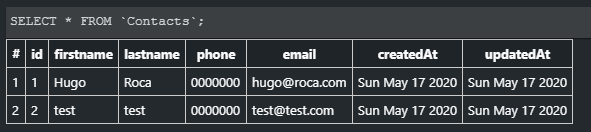

Bien, ahora seguimos y creamos una nueva carpeta a la nombraremos 'helpers' y dentro de esta creamos dos archivos, index.js y crud.js

```javascript
// helpers/index.js
module.exports = {
    CRUD: require('./crud')
}
```

```javascript
// helpers/crud.js
module.exports = {
    CREATE: 'create',
    READ: 'read',
    UPDATE: 'update',
    DELETE: 'delete'
}
```

Ahora creamos un nuevo archivo en la raíz del proyecto al que nombraremos como index.js.

```javascript
// index.js
const { CRUD } = require('./helpers')
const db = require('./models')

// con argv podemos parar parametros por consola a nodejs
const params = process.argv

if (params.length <= 2) {
    process.exit(0)
}

const args = params.slice(2)

// --create:Contact --firtsname=Hugo
const command = args[0].split(':')[0].substring(2)
const entity = args[0].split(':')[1]

switch (command) {
    case CRUD.CREATE:
        const data = {}
        args.slice(1).map((arg) => {
            const tmp = arg.split('=')
            data[tmp[0].substring(2)] = tmp[1]
        })
        db[entity].create(data).then(() => console.log('contact created!')).catch(console.log)
        break
    case CRUD.READ:
        db[entity].findAll().then(console.log).catch(console.log)
        break
    default:
        break
}
```

En este caso solo tenemos dos ejemplos del crud completo. Para poder probar nuestro código tendremos que ejecutar el archivo index.js de la raíz del proyecto de la siguiten manera.

```javascript
// Para crear uno nuevo
node . --create:Contact --firstname=cmd --lastname=cmd-test --phone=123456789 --email="hugo@roca.com"

// Para hacer el select completo
node . --read:Contact
```

Queda como tarea completar el crud. Estaré dejando el repositorio en este [enlace](https://github.com/HugoRoca/Node.js/tree/master/recursos/sequelize-test).


## Mongoose

Entonces que haremos en esta parte? Vamos a desarrollar un cron job para que haga web scraping, basicamente mostraremos noticias.

Para este proyecto vamos a necesitar tener mongo, podemos usar mongo atlas o uno que ya tengamos instalado.

> **Si quieres crear una cuenta en mogno atlas te dejo este articulo en donde se explica paso a paso https://medium.com/@hugo.roca/mongodb-como-configuraci%C3%B3n-de-cuenta-en-mongodb-atlas-959cdc7d9f81**

Como primer paso instalamos mongoose: `npm i mongose'
Luego instalamos lo siquiente: 

```javascript
npm i node-cron axios cheerio
// node-cron => nos ayudará a crear el cron que se ejeuctará en segundo plano
// axios => sera el encargado de enviar los request
// cheerio => recibira el html que axios nos devolverá
```

Luego de haber instalador los paquetes correspondientes vamos a crear un nuevo archivo en la raíz que se llamará `index.js`. Aqui crearemos una conexión de prueba hacia mongodb, su finalidad sera crear un modelo para luego insertar un dato que al final listaremos todo.

```javascript
const mogoose = require('mongoose')
const connection_string = 'mongodb+srv://hugoroca:<password>@cluster0-xu1hg.mongodb.net/db_test?retryWrites=true&w=majority'

mogoose.connect(connection_string, { useNewUrlParser: true })

const Cat = mogoose.model('Cat', {
    name: String
})

const kitty = new Cat({ name: 'Galfield' })
kitty.save().then(() => {
    console.log('Cat has been saved')
    Cat.find().then(console.log)
})
```

Ejecutamos el archivo index.js y el resutlado sera el siguiente:

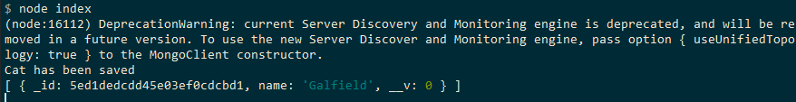

Y si lo vemos ya sea en mongodb atlas o mongo local se vere de la siguiente manera:

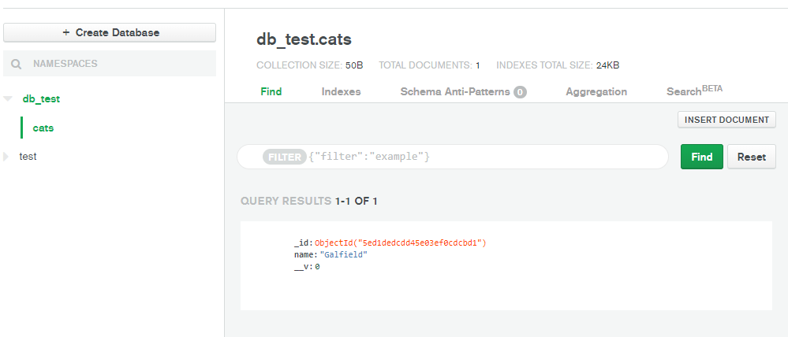

Ahora continuando con nuestro pequeño proyecto de cromjob, vamos a crear una nueva carpeta en donde alojaremos todo nuestro archivos.

Empezaremos inicializando el package.json e instalando las dependencias necesarias:

```javascript
npm i axios dotenv cheerio mongoose node-crom
```

Tambien crearemos un archivo el cual nos servira para guardar nuestras variables de entorno, lo nombreremos `.env`. Aquí estará nuestro srv para conectar a mongo.

```yml
MONGO_URI="mongodb+srv://hugoroca:<1234>@cluster0-xu1hg.mongodb.net/db_test?retryWrites=true&w=majority"
```

Tambien agregamos una carpeta a la cual llamaremos config, aqui creamos tambien un archivo `index.js` en donde definiremos el entorno usando env.

```javascript
if (process.env.NODE_ENV !== 'production') {
    require('dotenv').config()
}

module.exports = {
    MONGO_URI: process.env.MONGO_URI
}
```

Ahora definimos nuestro modelo, para ello crearemos una carpeta llamada models en la cual tendremos dos archivos, `index.js` y `breakingNew.model.js`.

```javascript
// breakingNew.model.js
const mongoose = require("mongoose")
const { Schema } = mongoose

const BreakingNewSchema = new Schema(
  {
    title: { type: String },
    link: { type: String },
  },
  { timestamps: { createdAt: true, updatedAt: true } }
)

module.exports = mongoose.model('BreakingNew', BreakingNewSchema)

// index.js
module.exports = {
    BreakingNew: require('./breakingNew.model')
}
```

Creamos un archivo `index.js` en la raíz del proyecto. Aqui definiremos el cronjob y la pagina de la extraeremos las noticias, tambien haremos uso del modelo creado previamente.

Con `* * * * * *` estamos diciendo que el cron se ejecute cada segundo. Si quisieras ver mas opciones puede visitar este pagina [https://crontab.guru/](https://crontab.guru/) en donde puedes contruir la expresion dependiendo del tiempo que quieres que se ejecute.

Dentro de cheerio hacemos uso de la clase `.news_title`, que es la que tiene las noticias.

```javascript
const mogoose = require("mongoose")
const { MONGO_URI } = require("./config")
const axios = require("axios").default
const cheerio = require("cheerio")
const cron = require("node-cron")
const { BreakingNew } = require('./models')

mogoose.connect(MONGO_URI, { useNewUrlParser: true })

cron.schedule('* * * * * *', async () => {    
    const html = await axios.get("https://cnnespanol.cnn.com/")
    const $ = cheerio.load(html.data)
    const titles = $(".news__title")
    titles.each((index, element) => {
        const breakingNew = {
            title: $(element).text().toString(),
            link: $(element).children().attr("href"),
        }

        BreakingNew.create([breakingNew])
    })
})

```

Y al ejecutar el cron podemos ver en mongo que tenemos la data registrada.

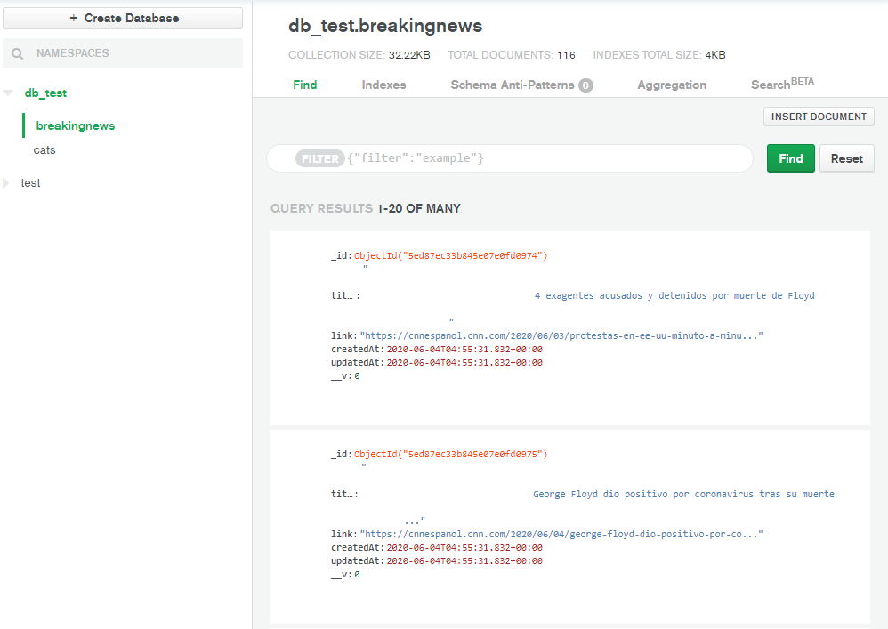

Dejare el proyecto en este [enlace](https://github.com/HugoRoca/Node.js/tree/master/recursos/mongodb-cromjob).

------
# Frontend y Backend

Vamos a ver un pequeño proyecto en donde definiremos el backend y frontend, usaremos typescript, angular y nodejs.

Para realizar el proyecto vamos a necesitar instalar typescript de manera global `npm i typescript -g`.

Empezaremos con el lado backend, para ello vamos a definir lo que vamos a crrear y utilizar.

- Usaremos express
- Crearemos un configurador de ambientes.
- Modelos
- Seeders
- Rutas
- Middlewares

Una vez terminada el API vamos a tener las siguientes ruta:

- GET /api/technologies => obtendra toda la data
- GET /api/technology/{id} => realizara un select por id
- GET /api/technology/search/{name} => realizará una busqueda por nombre

Bueno llego la hora de codificar, empezaremos creando una carpeta en donde alojaremos los proyectos tanto backend y frontend.

## Backend 

Empezaremos por el lado *backend*. Dentro de la carpeta backend iniciamos el package.json. `npm init -y`

Instalaremos cors, express y mongoose: `npm i cors express mongoose`.
Ahora tambien instalamos las dependencias de desarrollo: `npm i -D dotenv nodemon`

Configuramos el archivo `.env`

```yml
PORT=3000
MONGO_URI="mongodb+srv://..."
```

Luego agregamos una carpeta config y dentro de esta creamos un archivo `index.js`

```javascript
// config/index.js
if (process.env.NODE_ENV !== 'production') {
    require('dotenv').config()
}

module.exports = {
    PORT: process.env.PORT,
    MONGO_URI: process.env.MONGO_URI
}
```

Como siguiente paso tenemos que configurar el package.json, para ellos agregamos las dos lineas de código dentro del nodo scripts.

```json
{
    "start": "node index.js",
    "dev": "nodemon index.js"
}
```

Bien ahora nos centramos en archivo `index.js` que estará en la raíz

```javascript
// ./index.js
const server = require("./server")
const { PORT, MONGO_URI } = require("./config")
const mongoose = require("mongoose")

mongoose
  .connect(MONGO_URI, { useNewUrlParser: true })
  .then(() => {
    server.listen(PORT, () => {
      console.log("Server running on port", PORT);
    })
  })
  .catch(console.log)

```

A continuación vamos a crear y definir nuestros modelos en mongoose, empezaremos creando una carpeta models que contendrá dos archivos, `index.js` y `technology.model.js`.

```javascript
// models/technology.model.js
const mongoose = require("mongoose")
const { Schema } = mongoose

const TechnologySchema = new Schema(
  {
    name: { type: String, maxlength: 50 },
    description: { type: String },
    logo: { type: String },
    tags: [{ type: String }],
  },
  {
    timestamps: {
      createdAt: true,
      updatedAt: true,
    },
  }
)

module.exports = mongoose.model('Technology', TechnologySchema)
```

```javascript
// models/index.js
module.exports = {
    Technology: require('./technology.model')
}
```

Ahora para configurar nuestros seeds, creamos una carpeta a la cual llamaremos seeds, dentro de esta creamos un archivo al que nombraremos `technology.seed.js`.

```javascript
// seeds/technology.seed.js
const mongoose = require("mongoose")
const { MONGO_URI } = require("../config")
const { Technology } = require("../models")

mongoose.connect(MONGO_URI, { useNewUrlParser: true })

const technologies = [
  {
    name: "Node.js",
    description:
      "Node.js® is a JavaScript runtime built on Chrome's V8 JavaScript engine.",
    tags: ["node", "javascript", "backend"],
    logo: "node.svg",
  },
  {
    name: "Angular",
    description:
      "Angular is a platform for building mobile and desktop web applications. Join the community of millions of developers who build compelling user interfaces with Angular",
    tags: ["node", "javascript", "angular"],
    logo: "angular.svg",
  },
  {
    name: "Docker",
    description:
      "Docker is a tool designed to make it easier to create, deploy, and run applications by using containers. Containers allow a developer to package up an application with all of the parts it needs, such as libraries and other dependencies, and ship it all out as one package. By doing so, thanks to the container, the developer can rest assured that the application will run on any other Linux machine regardless of any customized settings that machine might have that could differ from the machine used for writing and testing the code.",
    tags: ["docker", "devops", "cli"],
    logo: "docker.svg",
  },
  {
    name: "Dotnet",
    description:
      ".NET is a free, cross-platform, open source developer platform for building many different types of applications. With .NET, you can use multiple languages, editors, and libraries to build for web, mobile, desktop, gaming, and IoT.",
    tags: ["dotnet", "microsoft", "csharp"],
    logo: "dotnet.svg",
  },
  {
    name: "firebase",
    description:
      "Firebase allows app teams for mobile and web devices to achieve success",
    tags: ["google", "firebase", "baas", "faas", "cloud"],
    logo: "firebase.svg",
  },
  {
    name: "Java",
    description:
      "Java is a programming language and computing platform first released by Sun Microsystems in 1995. There are lots of applications and websites that will not work unless you have Java installed, and more are created every day. Java is fast, secure, and reliable. From laptops to datacenters, game consoles to scientific supercomputers, cell phones to the Internet, Java is everywhere!",
    tags: ["oracle", "java", "vm", "oop"],
    logo: "java.svg",
  },
  {
    name: "Kubernetes",
    description:
      "is an open-source container-orchestration system for automating application deployment, scaling, and management.[4], It was originally designed by Google, and is now maintained by the Cloud Native Computing Foundation. It aims to provide a platform for automating deployment, scaling, and operations of application containers across clusters of hosts",
    tags: ["google", "k8", "kubernetes", "devops"],
    logo: "kubernetes.svg",
  },
  {
    name: "React",
    description:
      "React is a JavaScript library for building user interfaces. It is the view layer for web applications.",
    tags: ["facebook", "javascript", "framework", "frontend"],
    logo: "react.svg",
  },
  {
    name: "Python",
    description:
      "Python is an interpreted, object-oriented, high-level programming language with dynamic semantics. Its high-level built in data structures, combined with dynamic typing and dynamic binding, make it very attractive for Rapid Application Development, as well as for use as a scripting or glue language to connect existing components together. Python's simple, easy to learn syntax emphasizes readability and therefore reduces the cost of program maintenance. Python supports modules and packages, which encourages program modularity and code reuse. The Python interpreter and the extensive standard library are available in source or binary form without charge for all major platforms, and can be freely distributed.",
    tags: ["backend", "python", "oop", "ml"],
    logo: "python.svg",
  },
  {
    name: "Ruby",
    description:
      "Ruby is... A dynamic, open source programming language with a focus on simplicity and productivity. It has an elegant syntax that is natural to read and easy to write.",
    tags: ["ruby", "code", "oop"],
    logo: "ruby.svg",
  },
  {
    name: "Vue",
    description:
      "Vue.js is a progressive framework for building user interfaces. Unlike other monolithic frameworks, Vue is designed from the ground up to be incrementally adoptable. The core library is focused on the view layer only, and is easy to pick up and integrate with other libraries or existing projects.",
    tags: ["javascript", "vue", "frontend"],
    logo: "vue.svg",
  },
]

Technology.create(technologies)
  .then(() => {
    console.log("Technologies created")
  })
  .catch(console.log)
```

Para poder ejecutar el seed creado anteriormente tenemos que agregar la siguiente linea de codigo dentro del `package.json`.

```json
"seed": "node ./seeds/technology.seed.js"
```

Para ejecutarlo solo escribimos en la consola de comandos `npm run seed`, esto migrará los registros del seed a mongo.


Ahora como ultimo paso vamos crear una carpeta en la que tendremos la configuracion indicando con que paquete vamos a levantar nuestra API, esta configuración nos podría a futuro cuando queramos usar por ejemplo koa sin tener que modificar muchas cosas. Ademas este archivo tendrá todas nuestras rutas, no es una buena practica hacerlo asi pero mas adelante vamos a ver estructura de proyectos.

```javascript
// server/index.js
const express = require('express')
const server = express()
const cors = require('cors')
const { Technology } = require('../models')

server.use(express.json())
server.use(express.static(__dirname + '/../public'))
server.use(cors())

server.get('/api/technologies', async (req, res) => {
    let technologies = await Technology.find()
    technologies.forEach(technology => {
        technology.logo = `${req.protocol}://${req.headers.host}/img/${technology.logo}`
    })
    return res.send({
        error: false,
        data: technologies
    })
})

server.get('/api/technology/:id', async (req, res) => {
    const { id } = req.params
    let technology = await Technology.findById(id)
    technology.logo = `${req.protocol}://${req.headers.host}/img/${technology.logo}`
    return res.send({
        error: false,
        data: technology
    })
})

server.get('/api/technology/search/:name', async (req, res) => {
    const { name } = req.params
    let technologies = await Technology.find({ name: { $regex: new RegExp(name, 'i') } })
    technologies.forEach(technology => {
        technology.logo = `${req.protocol}://${req.headers.host}/img/${technology.logo}`
    })
    return res.send({
        error: false,
        data: technologies
    })
})


module.exports = server
```

Hasta aquí todo debería de funcionar correcto.

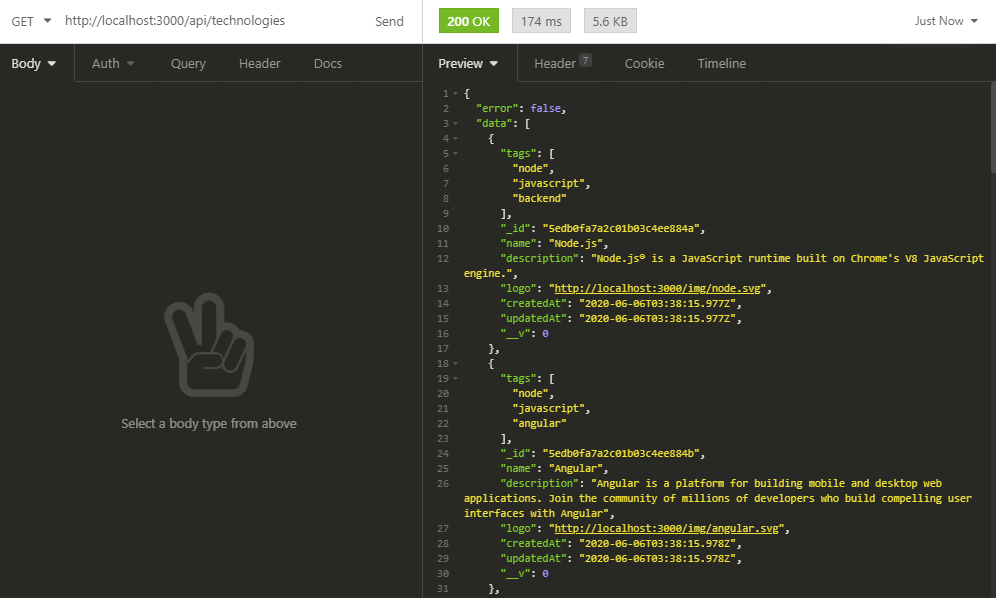

Por si no les salio, les dejo el repo en el siguiente [enlace](./recursos/frontend-backend/backend).

## Frontend

Antes de empezar con el desarrollo de frontend, debemos de conocer como se desarrolla en angular.

Si bien es cierto angular funciona con typescript, asi que conoceremos un poco de mas typescript.

> *Typescript esta pensando para proyectos grandes y escalables en donde los devs possean solidos conocimientos en OOP.*

Empezaremos por lo siguientes puntos:

- Tipos
- Funciones
- Interfaces
- Clases
- Decoradores

Para iniciar una configuración de typescript solo basta con ejecutar el sigueinte commando previamente instalado globalmente `tsc --init`. Esto nos creará un archivo json con algunas lineas comentadas, si queremos saber mas sobre la configuración podemos chekearnos la documentación.

### Tipos

```typescript
const framework: string = 'Angular'
// framework = 10 <- esto nos dará error
// el tipo es muy importante ya que define el tipo de dato
// existen tipos de datos como string, boolean, number (acepta decimal y entero), arrays, function

// en caso de funciones 
const sayHello: Function = (name: string): string => `Hello ${name}`
const value: string = sayHello('test')
console.log(value)
```

### Funciones

```typescript
/*
en javascript
function sum(a, b) {
    return a + b
}
*/

function sum(a: number, b: number): number {
    return a + b
}

// ahora veremos un funcion con parametro callback
function matchOperation(callback: Function, a: number, b: number): number {
    return callback(a, b)
}

// el primer parametro es un callback por esa razón mandamos una función flecha
const result: number = matchOperation((a: number, b: number): number => a + b, 5, 5)
```

### Interfaces

```typescript
interface IAnimal {
    name: string
    clor: string
}

const dog: IAnimal = {
    name: 'lucifer',
    color: 'red'
}

// en angular
interface OnInit {
    ngOnInit(): void
}

class MyComponent implements OnInit {
    ngOnInit(): void {
        console.log()
    }
}
```

### Clases

```typescript
/**
en javascript
class Pizaa {
    constructor(pizaa) {
        this.pizza = pizza
    }
}
const miniPizza = new Pizza('supreme')
*/

class Pizza {
    public tomate: boolean = false
    public chesse: string = ''
    public bacon: boolean = false
    public otherIngredients: Array<string> = ['']

    setChesse(chesse: string): Pizza {
        this.chesse = chesse
        return this
    }

    setBacon(bacon: string): Pizza {
        this.bacon = bacon
        return this
    }

    setOtherIngredients(otherIngredients: string[]): Pizza {
        this.otherIngredients = otherIngredients
        return this
    }

    build() {
        return this
    }
}

const pepperoniPizza: Pizza = new Pizza()
pepperoniPizza
    .setBacon()
    .setChesse('mozzarella')
    .setOtherIngredients(['Tomato'])
    .build()
console.log(pepperoniPizza)
```

### Decoradores

```typescript
function SelfDriving(constructorFunctions: Function) {
    constructorFunctions.prototype.selfDriving = true
}

function Wheels(numberOfWheels: number) {
    return function(constructor: Function) {
        constructor.prototype.wheels = numberOfWheels
    }
}

@SelfDriving
@Wheels(4)
class Car {
    private brand: string
    constructor(brand: string) {
        this.brand = brand
    }
}

const nissan: Car = new Car('Nissan')
console.log(nissan.selfDriving)
console.log(nissan.wheels)
```

> *En angular se usa mucho los decoradores.*

Antes que nada debemos de tener instalado nuestro paquete angular de manera global: `npm i -g @angular/cli` esto nos permitira usar el comando 'ng' que nos servira para inicar proyectos de angular, etc.

Luego de instalar angular, procedemos a crear un proyecto `ng new frontend`, en consola nos mostrará una opcion a la que seleccionamos *si* y seleccionamos *css*.

Nos creará la siguiente estructura:

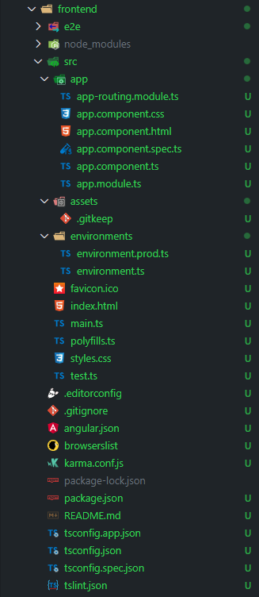

Y para poder ejecutar este proyecto solo escribimos lo siguiente: `ng serve`, por defecto corre en el puerto 4200, en la versión que estoy utilizando la pagina se ve así:

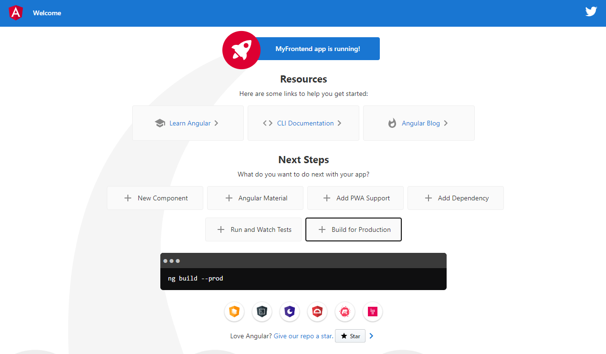

Bien, ahora empezaremos a crear nuestros componentes, paginas y servicios: es tan simple como ejecutar los siguientes comandos:

```
ng generate component components/technologyCard

ng generate component pages/about

ng generate component pages/search

ng generate component pages/technologies

ng generate component pages/technology

ng generate component pages/home

ng generate service services/http
```

Luego de haber creado los compnents, pages y services, procedemos a modificar los siguientes.

Empezaremos por el `index.html` que se encuentra que es el principal y le agregamos bootstrap.

```html
<!DOCTYPE html>
<html lang="en">
  <head>
    <meta charset="utf-8" />
    <title>Frontend</title>
    <base href="/" />
    <meta name="viewport" content="width=device-width, initial-scale=1" />
    <link rel="icon" type="image/x-icon" href="favicon.ico" />
    <link
      rel="stylesheet"
      href="https://stackpath.bootstrapcdn.com/bootstrap/4.5.0/css/bootstrap.min.css"
      integrity="sha384-9aIt2nRpC12Uk9gS9baDl411NQApFmC26EwAOH8WgZl5MYYxFfc+NcPb1dKGj7Sk"
      crossorigin="anonymous"
    />
  </head>
  <body>
    <app-root></app-root>
    <script
      src="https://code.jquery.com/jquery-3.5.1.slim.min.js"
      integrity="sha384-DfXdz2htPH0lsSSs5nCTpuj/zy4C+OGpamoFVy38MVBnE+IbbVYUew+OrCXaRkfj"
      crossorigin="anonymous"
    ></script>
    <script
      src="https://cdn.jsdelivr.net/npm/popper.js@1.16.0/dist/umd/popper.min.js"
      integrity="sha384-Q6E9RHvbIyZFJoft+2mJbHaEWldlvI9IOYy5n3zV9zzTtmI3UksdQRVvoxMfooAo"
      crossorigin="anonymous"
    ></script>
    <script
      src="https://stackpath.bootstrapcdn.com/bootstrap/4.5.0/js/bootstrap.min.js"
      integrity="sha384-OgVRvuATP1z7JjHLkuOU7Xw704+h835Lr+6QL9UvYjZE3Ipu6Tp75j7Bh/kR0JKI"
      crossorigin="anonymous"
    ></script>
  </body>
</html>
```

Luego modificamos nuestro archivo html que se encuntra en shared/navbar. Vamos a crear nuestra propio navbar usando bootstrap. Aqui tambien le estamos agregando un metodo para que se ejecute cuando se realiza una busqueda.

```html
<nav class="navbar navbar-expand-lg navbar-dark bg-dark">
  <a class="navbar-brand" href="#">Coding App</a>
  <button
    class="navbar-toggler"
    type="button"
    data-toggle="collapse"
    data-target="#navbarSupportedContent"
    aria-controls="navbarSupportedContent"
    aria-expanded="false"
    aria-label="Toggle navigation"
  >
    <span class="navbar-toggler-icon"></span>
  </button>

  <div class="collapse navbar-collapse" id="navbarSupportedContent">
    <ul class="navbar-nav mr-auto">
      <li class="nav-item active" routerLinkActive="active">
        <a class="nav-link" [routerLink]="['home']">Home</a>
      </li>
      <li class="nav-item" routerLinkActive="active">
        <a class="nav-link" [routerLink]="['technologies']">Technologies</a>
      </li>
      <li class="nav-item" routerLinkActive="active">
        <a class="nav-link" [routerLink]="['about']">About</a>
      </li>
    </ul>
    <form class="form-inline my-2 my-lg-0">
      <input
        class="form-control mr-sm-2"
        type="search"
        placeholder="Search"
        aria-label="Search"
        #searchQuery
        (keyup.enter)="searchTechnology(searchQuery.value)"
      />
      <button class="btn btn-outline-success my-2 my-sm-0" type="submit" (click)="searchTechnology(searchQuery.value)">
        Search
      </button>
    </form>
  </div>
</nav>
```

Bien. ahora como agregamos las rutas en los enlaces, debemos de crearlas, para ellos nos vamos al archivo `app-routing.module.js` y las agregamos.

```typescript
import { NgModule } from '@angular/core';
import { Routes, RouterModule } from '@angular/router';
import { HomeComponent } from './pages/home/home.component';
import { AboutComponent } from './pages/about/about.component';
import { TechnologiesComponent } from './pages/technologies/technologies.component';
import { SearchComponent } from './pages/search/search.component';
import { TechnologyComponent } from './pages/technology/technology.component';

const routes: Routes = [
  {
    path: 'home',
    component: HomeComponent,
  },
  {
    path: 'about',
    component: AboutComponent,
  },
  {
    path: 'technologies',
    component: TechnologiesComponent,
  },
  {
    path: 'technology/:id',
    component: TechnologyComponent,
  },
  {
    path: 'search/:query',
    component: SearchComponent,
  },
  {
    path: '**',
    pathMatch: 'full',
    redirectTo: 'home',
  },
];

@NgModule({
  imports: [RouterModule.forRoot(routes)],
  exports: [RouterModule],
})
export class AppRoutingModule {}
```

Y por ultimo, en el archivo `app.component.html` borramos todo y agregamos nuestro navbar.

```html
<app-navbar></app-navbar>
<div class="container">
  <router-outlet></router-outlet>
</div>
```

Luego modificas el archivo `app.module.ts`, de tal manera que agregamos los componentes y el cliente http.

```typescript
import { BrowserModule } from '@angular/platform-browser';
import { NgModule } from '@angular/core';
import { AppRoutingModule } from './app-routing.module';
import { AppComponent } from './app.component';
import { TechnologyCardComponent } from './components/technology-card/technology-card.component';
import { AboutComponent } from './pages/about/about.component';
import { SearchComponent } from './pages/search/search.component';
import { TechnologiesComponent } from './pages/technologies/technologies.component';
import { HomeComponent } from './pages/home/home.component';
import { NavbarComponent } from './shared/navbar/navbar.component';
import { HttpClientModule } from '@angular/common/http';
import { TechnologyComponent } from './pages/technology/technology.component'
import { FormsModule } from '@angular/forms'

@NgModule({
  declarations: [
    AppComponent,
    TechnologyCardComponent,
    AboutComponent,
    SearchComponent,
    TechnologiesComponent,
    HomeComponent,
    NavbarComponent,
    TechnologyComponent
  ],
  imports: [
    BrowserModule,
    AppRoutingModule,
    HttpClientModule,
    FormsModule
  ],
  providers: [],
  bootstrap: [AppComponent]
})
export class AppModule { }
```

Ahora en este caso como no estamos manejando un variables de entorno, angular nos da la opción de poder agregarlos en su archivo `envitoments.ts`, vamos a agregar la url en donde esta corriendo el lado backend.

```typescript
export const environment = {
  production: false,
  BASE_API_URL: 'http://localhost:3000/api'
};
```

Así mismo creamos un modelo con un interfaz dentro, esto estará en `src/app/models/technology.model.ts`

```typescript
export interface Technology {
  _id: string
  name: string
  description: string
  logo: string
  tags: string[]
  createdAt: Date
  updatedAt: Date
}
```

Bien ahora creamos los metodos que serviran para conectar al backend. Nos situamos en el archivo `http.service.ts`.

```typescript
import { Injectable } from '@angular/core';
import { HttpClient } from '@angular/common/http';
import { Technology } from '../models/technology.model'
import { environment } from 'src/environments/environment'

@Injectable({
  providedIn: 'root'
})
export class HttpService {
  private baseUrl: string = environment.BASE_API_URL

  constructor(private readonly _http: HttpClient) {}

  public getTechnologies() {
    return this._http.get<Technology[]>(this.baseUrl + '/technologies')
  }

  public getTechology(id: string) {
    return this._http.get<Technology>(this.baseUrl + '/technology/' + id)
  }

  public searchTechnology(query: string) {
    return this._http.get<Technology[]>(this.baseUrl + '/technology/search/' + query)
  }
}

```

Hasta aquí ya tenemos nuestro service apuntando al backend, ahora modificaremos el componente de cars. nos vamos a `technolody-card.component.ts`.

```typescript
import { Component, OnInit, Input } from '@angular/core';

@Component({
  selector: 'app-technology-card',
  templateUrl: './technology-card.component.html',
  styleUrls: ['./technology-card.component.css']
})
export class TechnologyCardComponent implements OnInit {

  @Input() technology: any = {}
  constructor() { }

  ngOnInit(): void {
  }

}
```

Ahora nos vamos a la pagina `technologies.component.ts` y hacemos los siguiente:

```typescript
import { Component, OnInit } from '@angular/core'
import { HttpService } from 'src/app/services/http.service'
import { Technology } from 'src/app/models/technology.model'

@Component({
  selector: 'app-technologies',
  templateUrl: './technologies.component.html',
  styleUrls: ['./technologies.component.css'],
})
export class TechnologiesComponent implements OnInit {
  public technologies: Technology[]

  constructor(public _httpService: HttpService) {}

  ngOnInit(): void {
    this._httpService
      .getTechnologies()
      .subscribe((technologies: Technology[]) => {
        this.technologies = technologies['data']
      })
  }
}
```

Y ahora en `technology.component.html`.

```html
<h1>
  {{ technology.name | uppercase }}
  <small>({{ technology.createdAt | date: "y" }})</small>
</h1>
<hr/>

<div class="row">
  <div class="col-md-4">
    
    <br/>
    <br/>
    <a [routerLink]="['/technologies']" class="btn btn-outline-danger btn-block">Go back</a>
  </div>
  <div class="col-md-8">
    <h3>{{ technology.name }}</h3>
    <hr/>
    <p>{{ technology.description }}</p>
    <p *ngFor="let tag of technology.tags">{{ tag }}</p>
  </div>
</div>
```

Hasta aquí debería de listarse todas las tecnologias en la página technologies. Ahora configuramos el sigueinte page `technology.component.ts`.

```typescript
import { Component, OnInit } from '@angular/core';
import { ActivatedRoute } from '@angular/router';
import { HttpService } from 'src/app/services/http.service';
import { Technology } from 'src/app/models/technology.model';

@Component({
  selector: 'app-technology',
  templateUrl: './technology.component.html',
  styleUrls: ['./technology.component.css']
})
export class TechnologyComponent implements OnInit {
  public technology: Technology = {
    name: '',
    description: '',
    logo: '',
    _id: '',
    tags: [],
    createdAt: null,
    updatedAt: null
  }

  constructor(private _activatedRoute: ActivatedRoute, private _httpService: HttpService) { }

  ngOnInit(): void {
    this._activatedRoute.params.subscribe(params => {
      const id = params['id']
      this._httpService.getTechology(id).subscribe((technology: Technology) => {
        this.technology = technology['data']
      })
    })
  }

}
```

Ahora configuramos el navbar para que realice la busqueda `navbar.component.ts`.

```typescript
import { Component, OnInit } from '@angular/core';
import { Router } from '@angular/router';

@Component({
  selector: 'app-navbar',
  templateUrl: './navbar.component.html',
  styleUrls: ['./navbar.component.css']
})
export class NavbarComponent implements OnInit {

  constructor(private _router: Router) { }

  ngOnInit(): void {
  }

  searchTechnology(query: string){
    this._router.navigate(['/search', query])
  }

}
```

En el archivo `search.component.html`.

```html
<h1>
  Searching: <small>{{ query }}</small>
</h1>

<div class="row" *ngUf="technologies.length == 0">
  <div class="col-md-12">
    <div class="alert alert-info" role="alert">
      There's not technoligies witt tis pattern: {{ query }}
    </div>
  </div>
</div>

<div class="card-columns">
  <app-technology-card
    [technology]="technology"
    *ngFor="let technology of technologies"
  ></app-technology-card>
</div>
```

En el archivo `search.component.ts`.


```typescript
import { Component, OnInit } from '@angular/core';
import { ActivatedRoute } from '@angular/router';
import { HttpService } from 'src/app/services/http.service';
import { Technology } from 'src/app/models/technology.model';

@Component({
  selector: 'app-search',
  templateUrl: './search.component.html',
  styleUrls: ['./search.component.css']
})
export class SearchComponent implements OnInit {
  technologies: Technology[] = []
  query: string
  constructor(private _activatedRoute: ActivatedRoute, private _httpService: HttpService) { }

  ngOnInit(): void {
    this._activatedRoute.params.subscribe(params => {
      this.query = params['query']
      this._httpService.searchTechnology(this.query).subscribe((technologies: Technology[]) => {
        this.technologies = technologies['data']
      })
    })
  }
}
```

Al final el proyecto debería de verse así:

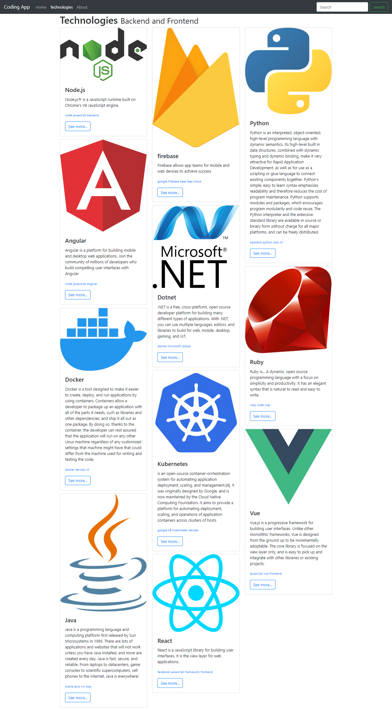

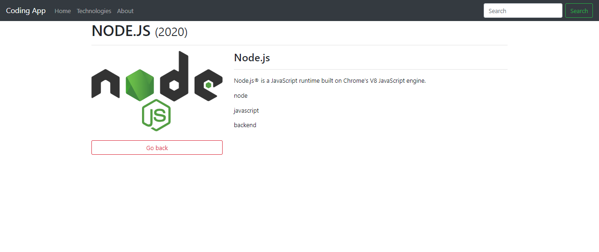


Por si no les salio, les dejo el repo en el siguiente [enlace](./recursos/frontend-backend/frontend).

------
# Palabras extrañas

- **CLI**: es un método que permite a los usuario dar instrucciones a algún programa informático por medio de una línea de texto simple:
  - Linux: Bash
  - Mac: Terminal
  - Windows: Command Promt
- **Código de máquina**: a veces llamado, lenguaje de máquina, estos son lenguajes de programación hablados por procesadores de computadora.
- **ECMA**: se trata de un acrónimo es "European Computer Manufacturers Association (ECMA)", una organización internacional basada en membresías de estándares para la comunicación y la información.
- **ECMAScript**: estándares por los cuales se rige de JavaScript.
- **Engine**: es un programa que convierte código javascript en algo que le procesador pueda entender.
- **Callback**: es una función "X" que se usa como argumento de otra función "Y". Cuando se llama a  "Y", esta ejecuta "X".
- **ACID**: Atomicidad, Consistencia, Aislamiento y Durabilidad, son propiedades que las bases de datos relacionales aportan a los sistemas y les permiten ser mas robustos y menos vulnerables ante fallos.
- **ORM**: Object Relational Mapping, es un modelo de programación que consiste en la transformación de las tablas de una base de datos, es una serie de entidades que simplifiquen las tareas básicas de acceso a los datos para el programador
- **Con Job**: es una herramienta extremedamente útil que es utilizada para implementar cualquier tarea repetitiva de manera automática, en linux en muy utilizada.
- **Web Scraping**: es una técnica utilizada mediante programas de software para extraer información de sitios web.
